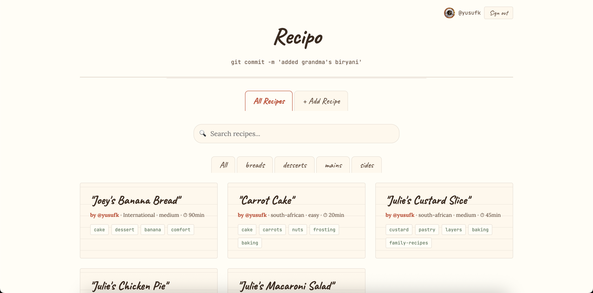

# Recipo 🍳

**Recipes, version controlled.** A git-based recipe site for devs who cook.

> `git commit -m 'added grandma's biryani'`



## What is this?

Recipo is a recipe sharing platform where **everything lives in Git**. No database, no CMS — just markdown files in a GitHub repo with a beautiful frontend that hides the complexity.

- **Browse** recipes without signing in
- **Submit** recipes via a form — creates a pull request behind the scenes
- **Edit** your own recipes — author-only editing
- **Vary** other people's recipes — fork their recipe into your own variation with attribution
- **Comment** on recipes via GitHub Discussions (powered by Giscus)
- **Search** across all recipes instantly

## How it works

| Layer | Technology |
|-------|-----------|
| Content | Markdown + YAML frontmatter in `recipes/` |
| Frontend | React + TypeScript + Vite |
| Hosting | GitHub Pages (free, auto-deploys) |
| Auth | GitHub OAuth (Web Application Flow) |
| Comments | Giscus (GitHub Discussions) |
| Images | Git LFS |
| Backend | Cloudflare Worker (OAuth token exchange only) |

```
User submits recipe → Fork → Branch → Commit markdown → Open PR → Maintainer merges → Live
```

## Recipe format

```markdown
---
title: "Butter Chicken"
author: yusufk
category: mains
cuisine: indian
serves: 4
prep_time: 20min
cook_time: 45min
difficulty: medium
tags: [chicken, curry, weeknight]
based_on: recipes/mains/original-butter-chicken.md  # optional, for variations
created: 2026-07-19
---

# Butter Chicken

## Ingredients
- 500g chicken thigh, cubed
- ...

## Method
1. Marinate chicken...
2. ...

## Notes
- Optional tips and variations
```

## Variations

Recipo has a "variation" system instead of editing other people's recipes:

- Only the **author** can edit their recipe
- Everyone else can **"Make a variation"** — creates a new recipe linked to the original
- The original shows all its variations
- Variations show "Based on [Original Recipe] by @author"

Think of it like forking — but for food.

## Development

```bash
# Clone
git clone https://github.com/yusufk/recipo.git
cd recipo

# Install
npm install

# Set up env (get a GitHub OAuth App client ID)
cp .env.example .env
# Edit .env with your client ID and worker URL

# Dev server
npm run dev
```

## Deploy

Push to `main` → GitHub Actions builds and deploys to GitHub Pages automatically.

The Cloudflare Worker (`worker/index.js`) handles OAuth token exchange:
```bash
npx wrangler deploy
npx wrangler secret put GITHUB_CLIENT_SECRET
```

## Contributing recipes

### Option 1: Via the website (easiest)

1. Visit https://yusuf.kaka.co.za/recipo/
2. Sign in with GitHub
3. Click "+ Add Recipe"
4. Fill in the form
5. Your recipe is submitted as a PR — a maintainer will review and merge it

### Option 2: Via pull request (for git users)

1. Fork this repo
2. Copy `recipes/_template.md` to `recipes/<category>/your-recipe-slug.md`
3. Fill in the frontmatter and content (see format below)
4. Add a photo to `images/your-recipe-slug.jpg` (optional, max 500KB)
5. Open a PR

**Categories:** `mains`, `desserts`, `sides`, `breads`, `drinks`, `snacks`, `breakfast`

**Required frontmatter fields:**

```yaml
---
title: "Your Recipe Title"
author: your-github-username
category: mains
cuisine: indian
serves: 4
prep_time: 20min
cook_time: 45min
difficulty: easy | medium | hard
tags: [tag1, tag2, tag3]
image: images/your-recipe-slug.jpg  # optional
based_on: recipes/category/original.md  # optional, for variations
created: 2026-07-19
---
```

**Body structure:**

```markdown
# Recipe Title

## Ingredients
- Use bullet points
- One ingredient per line
- Include quantities

## Method
1. Use numbered steps
2. Be clear and concise
3. Include temperatures and times

## Notes
- Optional tips, substitutions, or serving suggestions
```

**Guidelines:**
- Filename must be kebab-case (e.g. `butter-chicken.md`)
- `author` must match your GitHub username (this is how ownership works)
- Images must be JPEG or WebP, under 500KB
- Keep the body structure consistent: Ingredients → Method → Notes
- Don't modify other people's recipes — use "Make a variation" instead
- A PR template will auto-populate with a checklist when you open the PR

## Tech philosophy

- **Git is the database** — recipes are markdown files, fully versioned
- **GitHub is the auth** — no custom user system
- **PRs are contributions** — code review for food
- **Zero infrastructure cost** — GitHub Pages + Cloudflare Worker free tier
- **Portable** — your recipes are just files, take them anywhere

## License

MIT
